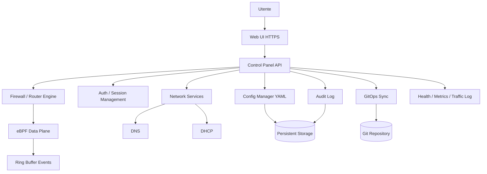

# songbird-architecture

```mermaid
flowchart TD
    U[Utente] --> UI[Web UI HTTPS]
    UI --> API[Control Panel API]

    API --> CFG[Config Manager YAML]
    API --> AUTH[Auth / Session Management]
    API --> AUDIT[Audit Log]
    API --> GIT[GitOps Sync]

    API --> FW[Firewall / Router Engine]
    FW --> BPF[eBPF Data Plane]

    API --> NET[Network Services]
    NET --> DNS[DNS]
    NET --> DHCP[DHCP]

    API --> OBS[Health / Metrics / Traffic Log]

    CFG --> STORE[(Persistent Storage)]
    AUDIT --> STORE
    GIT --> REPO[(Git Repository)]
    BPF --> EVT[Ring Buffer Events]
```
